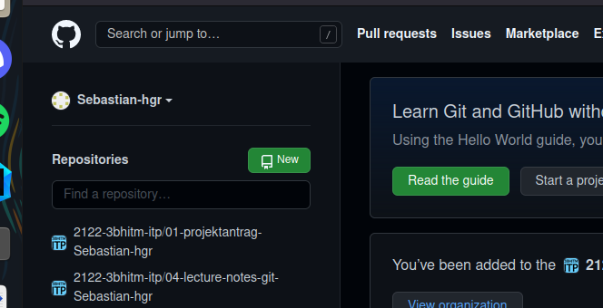
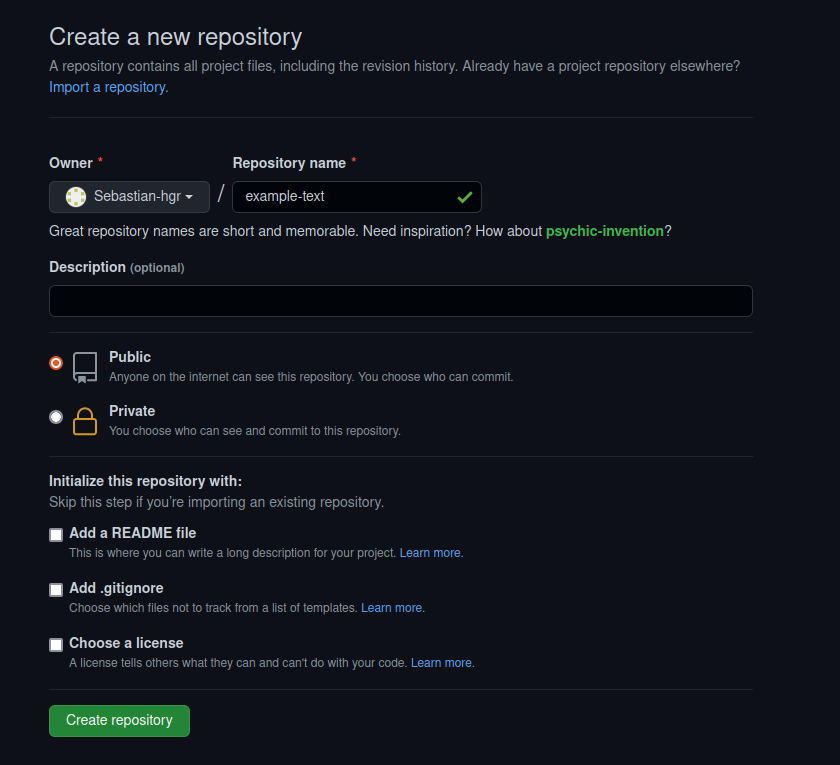
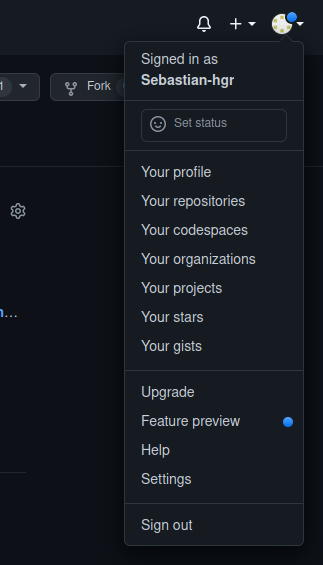
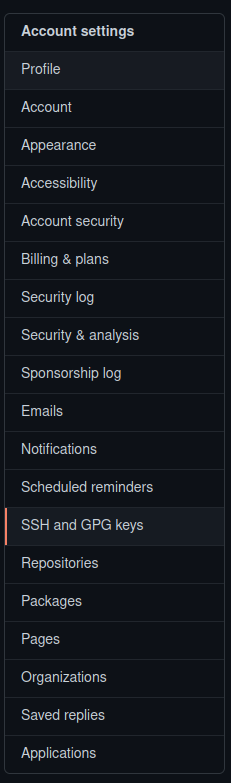
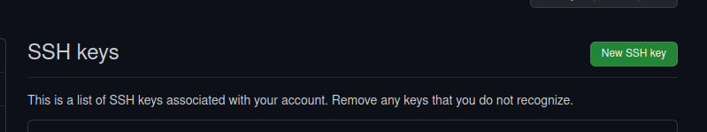

= Lecture Notes rsa-pub-key
Sebastian Hager
1.0.0, yyyy-mm-dd: Some notes
ifndef::imagesdir[:imagesdir: images]
//:toc-placement!:  // prevents the generation of the doc at this position, so it can be printed afterwards
:sourcedir: ../src/main/java
:icons: font
:sectnums:    // Nummerierung der Überschriften / section numbering
:toc: left

//Need this blank line after ifdef, don't know why...
ifdef::backend-html5[]

// print the toc here (not at the default position)
//toc::[]

== 14.Dec.2021

===  GitHub Repo erstellen

** Auf den Grünen Button klicken um ein Repo zu erstellen.

** Eindeutigen Namen wählen und Public auwählen danach auf Create respository klicken.

=== Locales-Repo und Remote-Verbindung zu Github einrichten

-----
#erstellen eines ordners
mkdir github-lab
#in den Ordner wechseln
cd github-lab/
#.git Ordner erstellen
git init
#erstellen eines README.md Files
echo "# 3BHITM-github-lab-branches" >> README.md
#folgende Schritte abarbeiten
git add README.md
git commit -m "first commit"
git branch -M main
git push origin main
git remote add origin <link des Repos>
git push origin main
-----

=== Erstellen des private key und public Key

** In folgenden Schritten erstellen wir einen public Key. In GitHub schreiben wir diesen ein, um die Authentifizierung bei einem commit zu überspringen.

-----
#in das home Verzeichnis wechseln
cd /home
#Key mit command generieren
ssh-keygen -t rsa
#in .ssh Verzeichnis wechseln
cd .ssh
#de id_rsa.pub Key in einem Editor öffnen und kopieren
gedit id_rsa.pub
-----
.den rsa_rsa.pub Key in GitHub einfügen
[%collapsible]
====
*** Klicken Sie auf ihren Account und danach auf Settings

*** Nun gehen Sie auf der Linken Seite auf "SSH and GPG keys"

*** Jetzt fügen Sie den Key mit "New SSH key" hinzu

====

